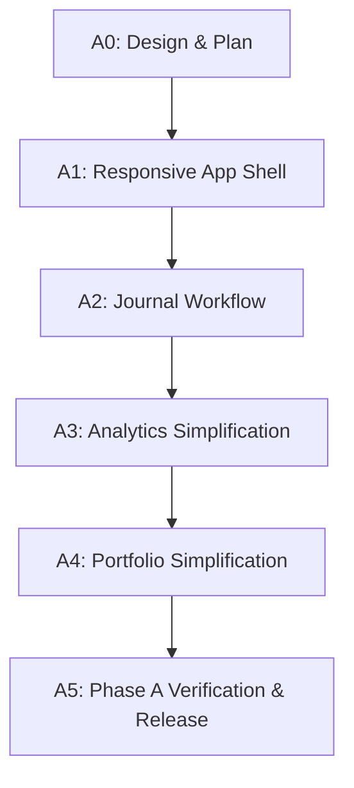

# Phase A Responsive UX/UI Detailed Implementation Plan

This document defines the step-by-step implementation plan for **Phase A: Responsive UX/UI** of the Trade Journal modernization. 

> [!IMPORTANT]
> **No functional UI changes or operational code changes** are implemented in this step. This file serves strictly as the executable blueprint (Step A0) to guide subsequent development iterations.
> **Verification Boundary:** Automated browser tests (Playwright) are currently unavailable in the environment. All visual layouts, touch targets, and mobile viewport tests are designated under `USER MANUAL CHECK` or `ANTI IDE REQUIRED`.

---

## 1. Safety and Isolation Boundaries

To protect the server environment, real trading data, and active systemd configurations, the following boundaries must be strictly enforced:

### 1.1 Operational Files Protection
- Do **NOT** modify, stage, or commit `.env.runtime`.
- Do **NOT** read or parse secrets from `.env.runtime` into plaintext stdout or logs.
- Do **NOT** modify or delete `data/db.sqlite` or any files in `data/uploads/` during testing and execution.

### 1.2 Test-Time Database Isolation
- All unit and integration tests must run against an **in-memory SQLite database** using `sqlite://` with `StaticPool` to prevent side effects on `data/db.sqlite`.
- API route testing via FastAPI `TestClient` must override the `get_session` dependency:
  ```python
  from app.database import get_session
  app.dependency_overrides[get_session] = get_test_session
  ```

### 1.3 Test-Time Uploads Isolation
- Tests involving image attachment or deletion must use a mock uploads path configured using Python's `tempfile.TemporaryDirectory`.

---

## 2. Phase A Detailed Steps



---

## Step A1: Responsive App Shell

### Objectives
- Create a unified responsive navigation layout:
  - **PC View:** Retain compact top header navigation.
  - **Mobile View (<= 720px):** 
    - Header height capped at 64px, containing only the "TJ" mark, current page title, and a **User Menu Trigger**.
    - Primary navigation moves to a fixed bottom navigation bar (height: 56px) showing: `매매일지` (Journal), `포트폴리오` (Portfolio), `분석` (Stats).
- Consolidate auxiliary actions into a single **User Menu Drawer** on mobile:
  - Theme toggle (Light/Dark).
  - KIS Sync trigger.
  - CSV exports (`Events`, `Lots`, `Allocations`).
  - Active role pill (`ADMIN` / `VIEWER`).
  - Logout form.
  - *Note: Leave a blank metadata slot to easily show the actual username in Phase B.*

### Files to Modify
- [app/templates/base.html](file:///opt/gyu/trading_journal/app/templates/base.html)
- [app/static/style.css](file:///opt/gyu/trading_journal/app/static/style.css)

### Files to Create / Test
- `tests/test_app_shell.py` (Asserts structural HTML tags, viewport meta, bottom-nav list items, and user menu container presence via Jinja context rendering).

### TDD Order & Command
1. Write assertions in `tests/test_app_shell.py` checking for the existence of `<nav class="bottom-nav">` and `#user-menu-drawer`.
2. Run tests (expect failure):
   ```bash
   .venv/bin/python -m unittest tests.test_app_shell
   ```
3. Implement HTML markup in `base.html` and styles in `style.css`.
4. Run tests (expect pass).

### Commit boundary
- `feat(ui): implement responsive app shell with mobile bottom nav and user menu`

### Verification Checkpoints
- `USER MANUAL CHECK`: Open on mobile (viewport <= 720px) and verify:
  - Header is <= 64px.
  - Bottom navigation is fixed at the bottom, safe-area-inset is respected, and does not overlay contents.
  - User Menu drawer slides open smoothly and contains all consolidated controls.

---

## Step A2: Journal Workflow

### Objectives
- Maintain compact spreadsheet-style layout on PC.
- Implement **Trade Cards** for Mobile View:
  - Suppress the `#journal-table` on mobile.
  - Display list of `journal-mobile-card` items showing: Ticker, Name, Action Type badge, Qty/Price, PnL metrics, Reason, and Action buttons (Attach/Edit/Delete).
- Consolidate search and filter tools into a collapsible **Filter Sheet** (Drawer) on mobile.
- Implement a floating **Quick Record FAB (`+` Button)** on mobile which opens a menu to choose BUY / SELL / CASHFLOW / SL drawers.
- Refactor and stabilize the `#drawer-edit` (Edit Drawer):
  - Handle numeric inputs safely (ensure valid zero inputs are not cleared).
  - Ensure Escape key listener triggers `closeAllDrawers()`.
  - Validate form values on submission and display inline validation messages.

### Files to Modify
- [app/templates/journal.html](file:///opt/gyu/trading_journal/app/templates/journal.html)
- [app/static/style.css](file:///opt/gyu/trading_journal/app/static/style.css)

### Files to Create / Test
- `tests/test_journal_ui.py` (Unit tests verifying HTML variables injection, card structure generation, and edit drawer input validation logic).

### TDD Order & Command
1. Create `tests/test_journal_ui.py` checking for the existence of `journal-mobile-cards` block and FAB container.
2. Run tests:
   ```bash
   .venv/bin/python -m unittest tests.test_journal_ui
   ```
3. Modify `journal.html` and `style.css`.
4. Run tests.

### Commit boundary
- `feat(ui): add mobile trade cards, quick action FAB, and validate edit drawer`

### Verification Checkpoints
- `USER MANUAL CHECK`: 
  - Verify cards are responsive and do not cause horizontal overflow.
  - Test input fields in Edit Drawer with a zero value (e.g. fee = 0) and verify it registers as `0` instead of blank.
  - Press `Escape` key inside the Edit Drawer and check if it closes.

---

## Step A3: Analytics Simplification

### Objectives
- Simplify metrics terminology for user accessibility:
  - **M2** -> `기간 수익률` (Primary return metric).
  - **M1** -> Hide under an expandable `고급 지표` accordion with textual definitions.
  - **Realized Return** -> `확정 수익률`.
- Consolidate charts:
  - Merge the 4 separate daily/weekly/monthly/yearly SVG/ApexCharts containers into a single dynamic chart container (`#stats-primary-chart`).
  - Add a segmented switcher button control: `Daily | Weekly | Monthly | Yearly` to dynamically trigger ApexCharts series updates (`chart.updateSeries`) via API fetch or preloaded dataset logic.
- Integrate **Monthly Check** directly into Stats page as a secondary tab view to eliminate page clutter.

### Files to Modify
- [app/templates/stats.html](file:///opt/gyu/trading_journal/app/templates/stats.html)
- [app/static/style.css](file:///opt/gyu/trading_journal/app/static/style.css)

### Files to Create / Test
- `tests/test_stats_ui.py` (Asserts correct translation labels and single-canvas configuration on template generation).

### TDD Order & Command
1. Write assertions in `tests/test_stats_ui.py` to ensure legacy charts (Daily/Weekly/Monthly/Yearly) do not have separate hardcoded SVG/ApexCharts containers, and verify `기간 수익률` copy.
2. Run tests:
   ```bash
   .venv/bin/python -m unittest tests.test_stats_ui
   ```
3. Update `stats.html` HTML markup, Javascript, and `style.css`.
4. Run tests.

### Commit boundary
- `feat(ui): simplify stats metrics and consolidate return charts under switcher`

### Verification Checkpoints
- `USER MANUAL CHECK`:
  - Toggle between `Daily`, `Weekly`, `Monthly`, and `Yearly` options on Stats chart. Verify only one ApexCharts canvas is rendered.
  - Verify theme change (dark/light toggle) properly updates the primary unified chart's colors and axes indicators.

---

## Step A4: Portfolio Simplification

### Objectives
- PC View retains detailed spreadsheet lots matrix.
- Mobile View displays compact **Ticker Cards**:
  - Highlights open value, cost, unrealized PnL, and open risk.
  - Shows lots details inside a responsive **accordion list** using collapsible components.
- Stabilize the refresh workflow:
  - Display explicit UI states during `/api/market-data/refresh` execution: Loading (spinner/stretching), Success (toast notification), Stale (data age warnings), and Failure (detailed error alerts).

### Files to Modify
- [app/templates/portfolio.html](file:///opt/gyu/trading_journal/app/templates/portfolio.html)
- [app/static/style.css](file:///opt/gyu/trading_journal/app/static/style.css)

### Files to Create / Test
- `tests/test_portfolio_ui.py` (Verifies state tags, mobile layout structure, and lot list rendering).

### TDD Order & Command
1. Create `tests/test_portfolio_ui.py` to test template rendering with empty and active portfolios.
2. Run tests:
   ```bash
   .venv/bin/python -m unittest tests.test_portfolio_ui
   ```
3. Edit `portfolio.html` and styles.
4. Run tests.

### Commit boundary
- `feat(ui): implement mobile portfolio ticker cards and refresh loading states`

### Verification Checkpoints
- `USER MANUAL CHECK`:
  - Verify portfolio lot tables wrap correctly or collapse gracefully under card accordion.
  - Click "Refresh Price/FX" and verify loading indicators display correctly prior to reload.

---

## Step Step A5: Verification & Production Release

### Objectives
- Run all project tests excluding `tests/test_japan_market.py`.
- Conduct exhaustive visual inspects across various viewport sizes (360px, 390px, 768px, 1440px).
- Verify git staged area is pristine of any credentials or database artifacts.

### Commands to Run
1. Discover and execute all safe test modules:
   ```bash
   mapfile -t test_modules < <(find tests -maxdepth 1 -type f -name 'test_*.py' ! -name 'test_japan_market.py' -printf '%f\n' | sed -e 's/\.py$//' -e 's#^#tests.#' | sort)
   .venv/bin/python -m unittest -v "${test_modules[@]}"
   ```
2. Verify git diff before release:
   ```bash
   git status --short
   git diff --cached --name-only
   ```

### Verification Checkpoints
- `USER MANUAL CHECK`: Perform final live check of:
  - Touch target sizes (minimum 44px for main nav/buttons).
  - Scroll performance and virtualkeyboard overlays on forms.
  - Zero console errors in web browser developer tools.
